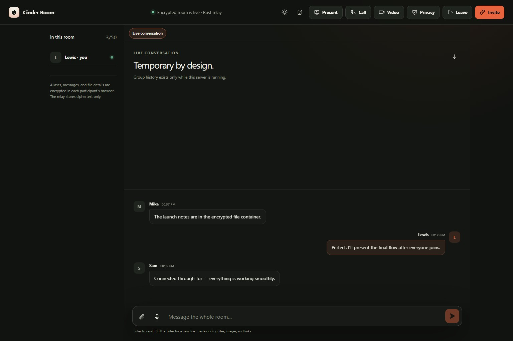
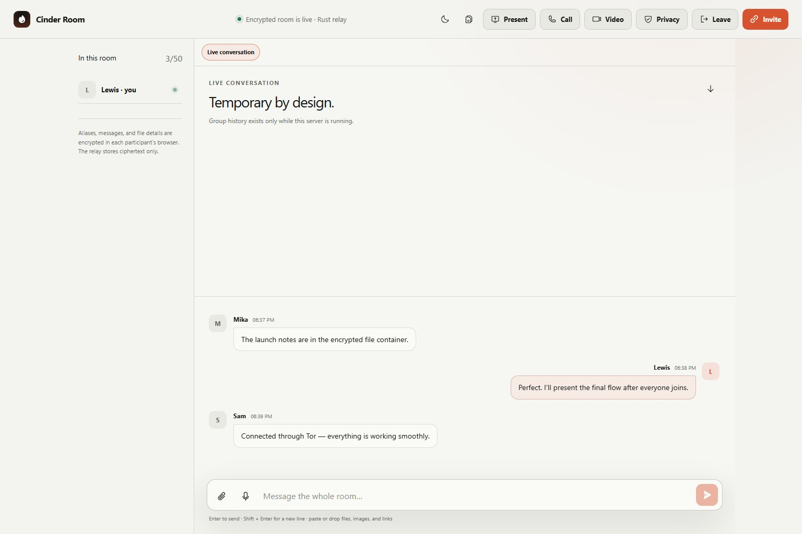
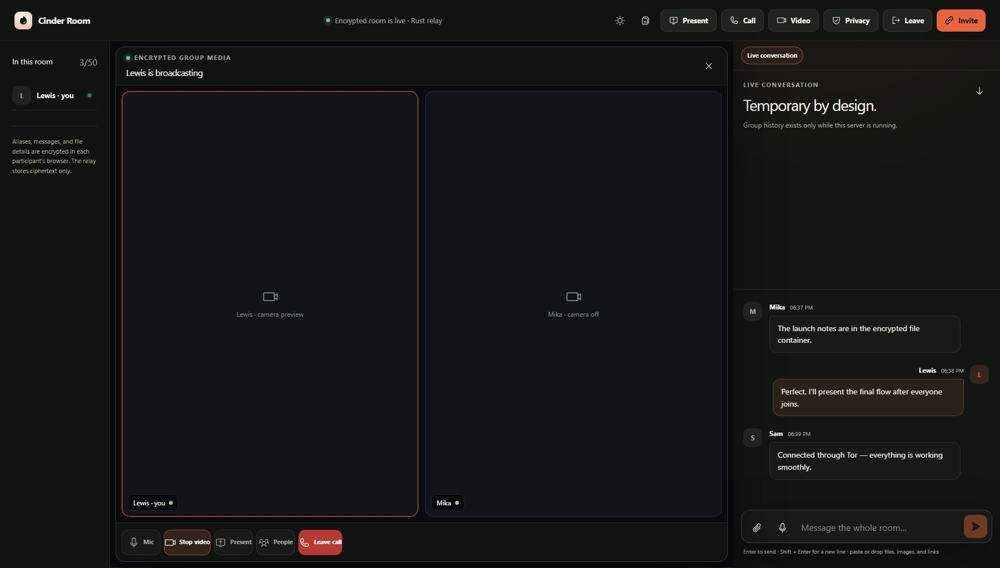
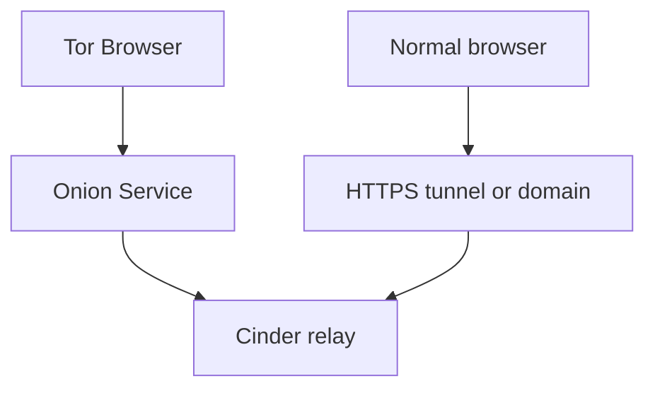

# Cinder Room

[](https://github.com/lewisjohnvillamor/Cinder-Room/actions/workflows/ci.yml)
[](LICENSE)
[](rust-toolchain.toml)
[](package.json)

Run one temporary, self-hosted room and share its capability link. Cinder Room provides end-to-end encrypted group and direct chat, files, group video, screen sharing, waiting-room controls, and meeting activities. The Rust relay is the default; a protocol-compatible Node relay remains available for development and fallback.







## What it includes

- End-to-end encrypted group messages, relay-targeted direct messages, aliases, file contents and metadata, screen-relay segments, and meeting activities
- Group camera and microphone, camera plus screen, active-speaker/grid/spotlight layouts, pinning, picture-in-picture, and adaptive quality through a self-hosted LiveKit SFU
- Persistent broadcast indicator with Join/Rejoin, plus full-width desktop media and focused Video/Chat views on mobile
- Host waiting room with in-room admit/deny prompts, lock, mute, remove, and destroy-room controls
- Raise hand, reactions, Q&A, quick polls, and opt-in browser captions
- Responsive participant and conversation tabs, unread direct-message badges, and left-drawer file storage
- Independent Tor Onion Service and normal-browser routes
- Memory-only room state and temporary ciphertext files removed when the process exits normally
- No accounts, analytics, database, paid API, recording, or hosted Cinder service

## Practical use cases

Cinder Room is designed for temporary collaboration where participants want to control the infrastructure and avoid permanent account or message history. Suitable uses include:

- Confidential team, client, legal, financial, research, or incident-response meetings
- Private presentations with encrypted media, group chat, direct conversations, and temporary files
- Short-lived support sessions involving screen sharing, documents, or sensitive troubleshooting details
- Coordination by journalists, nonprofits, community groups, or small teams that do not want a hosted Cinder account
- Exchanging temporary credentials, one-time passwords, recovery codes, sensitive links, or access instructions

For sensitive secret sharing, verify the recipient through a separate trusted channel, share the complete **Invite** URL privately, lock the room after the expected participants arrive, confirm their aliases, send the secret through direct chat, and destroy the room after receipt. Rotate or invalidate the credential afterward whenever possible. A dedicated audited secret manager remains the better choice for long-lived production credentials.

“Encrypted” does not mean that nobody can listen under every circumstance. Cinder protects message and media content from ordinary relay, tunnel, and network observation when the software and participant devices are trustworthy. It cannot prevent an invited participant from copying or recording content, someone with the complete invitation from joining, malware or browser extensions from reading the screen, or infrastructure providers from observing connection metadata, timing, and approximate traffic sizes. See [Privacy and threat model](#privacy-and-threat-model) for the full limits.

## Start locally

Requirements: Node.js 22.13+, npm, and Rust 1.94. Optional route helpers are `tor` and `cloudflared`; Cinder can download `cloudflared` automatically on first start when `CINDER_ROUTES` includes Cloudflare. Optional native group media uses `livekit-server`.

```bash
git clone https://github.com/lewisjohnvillamor/Cinder-Room.git
cd Cinder-Room
npm ci
npm run room
```

The terminal prints the private host URL. Open it, choose an alias, then use **Invite** to copy guest URLs. The room key is created in the host browser and placed after `#k=` in guest URLs. URL fragments are not sent in HTTP requests.

`npm run room` builds the browser client and starts the Rust relay. To use the compatibility relay:

```bash
CINDER_RELAY=node npm run room
```

Press `Ctrl+C` to destroy the server-side room. **Leave** disconnects only the current participant; **Destroy room** ends it for everyone and does not automatically open a replacement room or tunnel. Start `npm run room` again when a new room is wanted. A hard power loss or `SIGKILL` can bypass orderly cleanup, so inspect the operating system's temporary directory in that case.

Always share a URL produced by **Invite**. The complete guest URL contains `#k=`; opening a private host/bootstrap URL on another device can create a different encryption key, preventing the devices from decrypting one another. Cinder now reports that mismatch instead of silently hiding those participants.

### Docker

```bash
docker build -t cinder-room .
docker run --rm -it -p 127.0.0.1:3000:3000 cinder-room
```

The production image contains the compiled Rust relay, static browser assets, CA certificates, and Tor. It does not ship the Node relay or development toolchain. Its default route is Onion-only; run a separately installed Cloudflare tunnel when a temporary normal-browser link is wanted:

```bash
cloudflared tunnel --url http://localhost:3000
```

Append the host URL's `/room/<room-id>#o=<owner-token>` suffix to the generated HTTPS origin. Cloudflare Quick Tunnels are convenient and free. They do not require a Cloudflare account, API token, DNS record, or domain, but they use a temporary random `*.trycloudflare.com` address and are intended only for testing and short-lived rooms. A stable named tunnel requires a Cloudflare account and a domain using Cloudflare DNS.

## Rust parity

“Parity” means both relays implement the same externally observable room protocol—not that they share source code. In v0.9, Rust and Node both implement:

| Protocol area | Rust | Node fallback |
| --- | :---: | :---: |
| Encrypted chat history and presence | Yes | Yes |
| Relay-targeted direct chat and unread delivery | Yes | Yes |
| Encrypted file relay and limits | Yes | Yes |
| Waiting room, lock, admit, and deny | Yes | Yes |
| Host mute, remove, and destroy | Yes | Yes |
| Encrypted reactions, hands, Q&A, polls, and captions | Yes | Yes |
| Presentation start/chunks/late-join replay | Yes | Yes |
| Room-scoped LiveKit tokens bound to admitted sockets | Yes | Yes |
| Guardrails and ephemeral cleanup | Yes | Yes |

The static parity test checks the shared event surface, and integration suites exercise each relay. CI compiles, formats, lints, and tests Rust in addition to the web and Node fallback paths.

## Network routes: Onion and normal browsers

Tor and Cloudflare do not run one after the other. They are independent entry routes into the same local relay:



- An Onion Service supplies its own `.onion` address; no domain or router port-forward is required.
- People without Tor Browser use an HTTPS route: an account-free temporary Quick Tunnel, a named Cloudflare Tunnel, or a domain pointed at their own VPS.
- The routes receive the same opaque ciphertext. One route does not proxy through the other.
- Tor is useful for chat and modest file transfer but is generally unsuitable for low-latency group video.

## Privacy and threat model

The browser uses Web Crypto AES-256-GCM. The 256-bit room key stays in the invitation fragment and is never intentionally sent to Cinder. A packet capture such as Wireshark should see TLS/Tor traffic, timings, endpoints, and approximate sizes—not readable messages or files. The relay retains bounded ciphertext only for the room lifetime.

This is privacy engineering, not a guarantee of total anonymity:

- The tunnel, Onion entry path, VPS, LiveKit/TURN host, ISP, and browsers can expose different pieces of network metadata.
- A normal HTTPS route can reveal participant IP addresses to the route operator or origin unless the chosen proxy design prevents it.
- TURN/SFU prevents participants from learning one another's direct addresses, but the owner-operated media server sees connection addresses and traffic metadata.
- A participant can save files, copy text, photograph a screen, or use operating-system recording.
- A compromised browser/device, leaked invitation, malicious dependency, server modification, or endpoint logging defeats relevant protections.
- Cinder has not yet received an independent cryptographic or security audit. Do not treat it as suitable for high-risk operational security without one.

## Group video and screen sharing

Cinder uses the free, open-source LiveKit Community Edition as a self-hosted SFU. Browsers publish encrypted camera, microphone, screen, and screen-audio tracks to the SFU instead of forming a full peer-to-peer mesh. Cinder derives a separate media key from the invitation key using HKDF and configures LiveKit browser E2EE; the SFU routes encrypted media but still sees connection metadata and bandwidth.

Starting a call publishes an encrypted call-status event. Other room members see a pulsing broadcast indicator and can join or rejoin while a broadcaster remains active. Joining begins receive-only: camera and microphone permissions are requested only when their controls are enabled. Closing the media workspace uses the same teardown as **Leave call**, disconnecting media and releasing local tracks. On phones, **Video** and **Chat** are focused full-height views rather than a cramped split screen; switching views does not leave the call.

After admission, the relay gives each browser a short-lived connection capability for file and media HTTP requests. The capability is held only in memory, revoked on disconnect, rate-limited, and never included in invitations. LiveKit join tokens expire after five minutes.

For local development, `npm run room` can start an installed `livekit-server` with one-session credentials generated in memory. Public group media needs a reachable `wss://` address, trusted TLS, and WebRTC/TURN ports. A Cloudflare Quick Tunnel carries the room app, chat, files, and encrypted fallback presentation, but it does not provide LiveKit's required public UDP media path.

If LiveKit is unavailable, **Present** can use Cinder's encrypted MediaRecorder fallback through the existing Socket.IO route. It targets roughly 720p/12–15 FPS, carries no microphone, allows one presenter, and is bounded to five minutes/64 MB of replay ciphertext.

Recording is deliberately excluded.

## DigitalOcean: all-in-one public deployment

The included [`deploy/digitalocean`](deploy/digitalocean/README.md) bundle runs Cinder, LiveKit, TURN/UDP, and Caddy HTTPS on a Droplet you control. It requires two DNS names, such as `room.example.com` and `media.example.com`, and these public firewall rules:

| Protocol | Ports | Purpose |
| --- | --- | --- |
| TCP | 80, 443 | HTTPS, WSS, certificate issuance |
| TCP | 7881 | WebRTC TCP fallback |
| UDP | 3478 | TURN/UDP |
| UDP | 50000–60000 | WebRTC media |

A 1 GB instance is suitable only for evaluation or very small calls; a 2 GB instance is a safer small-room baseline. Software is free/open source, but the VPS, domain, and outbound bandwidth may cost money.

[DigitalOcean referral link](https://m.do.co/c/2b70ddbc175d)

## Capacity and guardrails

All admitted participants can type simultaneously. The relay serializes accepted ciphertext events into a consistent room order. Uploads are concurrent up to the configured lane limit; additional attempts receive HTTP 429 and can retry. One fallback screen presenter is allowed at a time. Native LiveKit screen and camera tracks are limited by the SFU and UI policy.

The 50-connection default is a safety ceiling, not a group-video capacity promise. Start around 10–25 chat participants, or 2–6 active video publishers on a small VPS, then load-test the exact hardware, region, resolution, and subscriber pattern.

| Guardrail | Default |
| --- | ---: |
| Connections | 50 |
| Message burst | 30 per participant / 10 seconds |
| Message history | 500 ciphertext events |
| Meeting activity | 150 ciphertext events; 40 / 10 seconds |
| Concurrent uploads | 4 |
| File size | 100 MB cleartext plus encryption overhead |
| Temporary files | 200 |
| Room file storage | 1 GB ciphertext |
| Fallback presentation | 1 presenter; 5 minutes; 500 chunks; 64 MB |
| Room lifetime | 180 minutes |

File encryption currently occurs in browser memory, so large files also require sufficient participant-device RAM. End-to-end encryption prevents the relay from malware-scanning uploads or content-moderating messages; open only files you trust.

## Configuration

Copy `.env.example` to `.env` or export variables before starting:

| Variable | Default | Purpose |
| --- | --- | --- |
| `PORT` | `3000` | Relay port |
| `CINDER_BIND` | `127.0.0.1` | Listener; containers set `0.0.0.0` |
| `CINDER_ROUTES` | `both` | `both`, `tor`, `cloudflare`, or `local` |
| `CINDER_AUTO_INSTALL_CLOUDFLARED` | `true` | Download `cloudflared` into `.cinder-bin/` when Cloudflare routing is enabled and the binary is missing |
| `CINDER_RELAY` | `rust` | `rust` or `node` |
| `ROOM_TTL_MINUTES` | `180` | Automatic room shutdown |
| `MAX_PARTICIPANTS` | `50` | Connection ceiling |
| `MAX_FILE_MB` | `100` | Per-file cleartext limit |
| `MAX_CONCURRENT_UPLOADS` | `4` | Upload lanes |
| `MAX_FILES` | `200` | Temporary file count |
| `MAX_ROOM_STORAGE_MB` | `1024` | Total ciphertext storage |
| `SCREEN_MAX_MINUTES` | `5` | Fallback presentation duration |
| `LIVEKIT_URL` | empty | Public `wss://` media endpoint |
| `LIVEKIT_API_KEY` | generated/empty | LiveKit token issuer key |
| `LIVEKIT_API_SECRET` | generated/empty | LiveKit signing secret |
| `LIVEKIT_CONFIG` | empty | LiveKit YAML when Cinder owns the process |
| `CINDER_START_LIVEKIT` | `false` | Start/stop configured LiveKit with the room |

Never commit `.env` or LiveKit secrets.

## Development and verification

```bash
npm ci
npm run lint
npm test
npm run test:room          # Rust unit/integration protocol
npm run test:room:node     # TypeScript compatibility relay
npm run test:room:bundled  # Production-style bundled Node fallback
```

Important source areas:

- `rust-server/` — default Axum/Socketioxide relay
- `server/index.ts` — Node/Express/Socket.IO compatibility relay
- `server/client-entry.tsx` and `components/` — encrypted room UI
- `deploy/digitalocean/` — Cinder + LiveKit + Caddy deployment
- `tests/` — render, theme, credential, mobile, parity, and relay integration tests

Security reports should avoid public disclosure until a fix is available. Contact [lewisvillamor26@gmail.com](mailto:lewisvillamor26@gmail.com).

## License and support

Copyright © 2026 Lewis John Villamor. Licensed under [GNU GPL v3 or later](LICENSE).

[Buy Lewis a coffee via PayPal](https://www.paypal.com/paypalme/lewisjohnvillamor/250)
